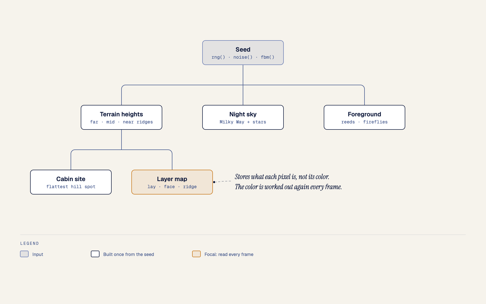
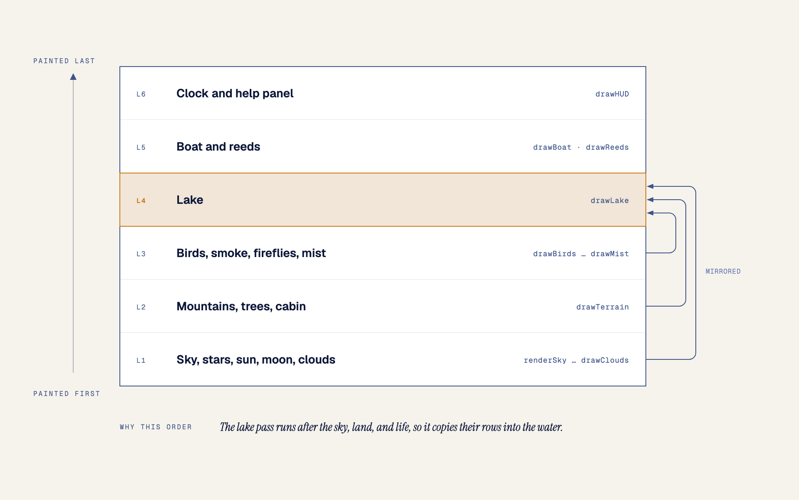
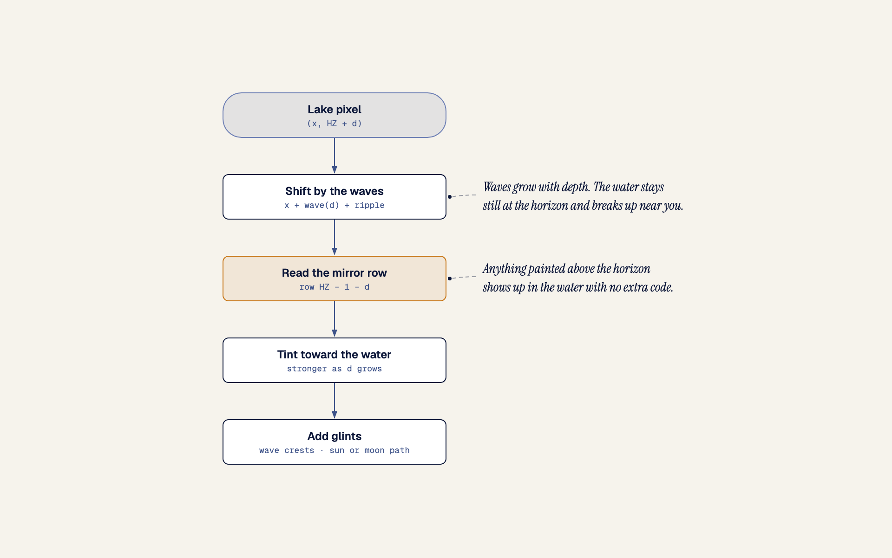

# Starlake

A living pixel-art lake that runs in the browser. One HTML file, no dependencies.

**Open it: https://chengboonrong.github.io/starlake/**


## Summary

Starlake paints a mountain lake as pixel art and keeps it moving. Each visit builds a new landscape from a seed: snowy peaks, forested hills, and a cabin on the shore. The lake mirrors everything above the horizon. Time runs at 20 times real speed by default, so one hour of scene time takes 3 real minutes and you see the whole day go by.

What you see changes with the hour:

- At night there are stars, the Milky Way, an aurora, shooting stars, fireflies, and a lit cabin window. The moon shows today's real phase.
- By day there is sun glare on the water, white clouds, and passing flocks of birds.
- Sunrise and sunset bring their own sky colors and low mist over the water.
- At every hour, chimney smoke rises, a rowboat drifts across the lake, fish leave ripples, and the reeds sway.

Everything is drawn by `index.html`, about 1,000 lines of plain JavaScript with no libraries, image files, or build step. `apple-touch-icon.png` and `preview.png` exist only for the home-screen icon and this README.

## Run it

Open the link above, or open `index.html` in a browser. On an iPad or iPhone, Share → **Add to Home Screen** on the link runs it full screen.

To run your own copy on an iPad, load it over HTTP (the Files app preview doesn't run scripts). From this folder:

```sh
python3 -m http.server 8765
```

Then open `http://<your-computer's-ip>:8765` in Safari. Share → **Add to Home Screen** runs it full screen.

## Controls

| Input | Action |
| --- | --- |
| Click / tap the sky | Shooting star (birds in daytime) |
| Click / tap the lake | Ripple |
| Drag, scroll wheel, ← → | Scrub through the day |
| ↑ ↓ | Time speed (1×, 20×, 120×, 600×) |
| Space | Pause time |
| L | Follow your local clock |
| A | Aurora on / off |
| C | Clouds: clear, few, cloudy |
| N | New landscape |
| F | Fullscreen |
| H | Help panel (on touch screens, tap a line to use it) |

## URL options

Settings can go in the URL hash, e.g. `index.html#seed=4242&t=22.5`.

| Key | Meaning |
| --- | --- |
| `seed` | Landscape seed (shown in the help panel) |
| `t` | Starting hour, 0–24 |
| `speed` | `1`, `20`, `120` or `600` |
| `paused=1` | Start with time paused |
| `live=1` | Follow the local clock |
| `aurora=0` | Start with the aurora off |
| `clouds` | `0`, `1` or `2` |
| `moon` | Moon phase override, 0–1 (0 new, 0.5 full) |
| `help=1` | Open the help panel |

## How it works

### Build the world once, then paint every frame

The script has two phases. `setup()` and `generate()` run on load, on resize, and when you press **N**. They pick the canvas size and build every part of the landscape that never moves. `frame()` then runs on every animation frame. It works out the time of day and repaints the whole picture into one pixel buffer. At the end of the frame, `putImageData()` copies that buffer to the canvas.

### Draw on a tiny canvas and scale it up

The scene is about 180 pixels along the short side of the screen. `setup()` picks a whole number of screen pixels per scene pixel, and CSS scales the canvas up with `image-rendering: pixelated`. On a 1080p screen the scene is 320 × 180, and each scene pixel is a 6 × 6 block on screen.

The small buffer makes per-pixel work affordable. The lake alone reads and writes all 23,040 of its pixels every frame, and the frame still runs at 60 fps in Chromium on an M1 MacBook Pro.

Pixel art can't blend colors smoothly, so Starlake fakes the blend with ordered dithering. A 4 × 4 Bayer matrix gives every pixel a threshold between 0 and 1. A pixel that sits 30% of the way between two colors takes the second color only where its threshold is below 0.3. That one rule draws the banded sky, the soft edges of glows and clouds, and the shading on rock faces.

### Build the landscape from a seed

`generate()` feeds the seed into a small random number generator (`rng`, a mulberry32) and into seeded value noise (`noise` and `fbm`). The same seed always gives the same landscape, which is why the seed goes in the URL.

<picture>
  <source media="(prefers-color-scheme: dark)" srcset="docs/diagrams/starlake-world-from-seed-dark.png">
  
</picture>

The layer map stores what each pixel is, not its color. Color depends on the time of day and on where the light comes from, and both change every frame. To find which way a rock pixel faces, `generate()` reads the slope of the ridge line above it. Pixels near the ridge use a narrow slope window, so small crags show. Deeper pixels use a wider window and merge into broad faces. A little noise in the sample position keeps the line between two faces ragged. Snow, the far treeline, the pines, and the cabin sprite are stamped into the same map afterward.

### Paint a frame from back to front

`frame()` paints in a fixed order. Each step draws over the steps before it, so the order decides what hides what. The mountains hide the moon as it sets, and the clouds hide the stars.

<picture>
  <source media="(prefers-color-scheme: dark)" srcset="docs/diagrams/starlake-paint-order-dark.png">
  
</picture>

`drawLake` runs late on purpose. It builds the water by reading the rows already painted above the horizon, so everything drawn before it appears in the reflection with no extra code. That includes the moon, shooting stars, fireflies, the cabin window, and the chimney smoke. The boat and the reeds sit on the water, so they come after `drawLake`, and the boat draws its own reflection and lantern streak.

### Read the sky upside down to make the lake

For a lake pixel at depth `d` below the horizon, `drawLake` copies the pixel at row `HZ - 1 - d`, its mirror position. Before the read, it shifts the column by a wave offset. The offset grows with depth. Water near the horizon stays almost still, and water near the viewer breaks the reflection into strips.

<picture>
  <source media="(prefers-color-scheme: dark)" srcset="docs/diagrams/starlake-lake-pixel-dark.png">
  
</picture>

Ripples are ellipses that flatten toward the horizon, so a ring far away looks thin and a ring close by looks round. Each ring also moves the read position by one pixel, which bends the reflection around it. Clicks add ripples, the boat leaves a wake, and fish surface every few seconds. At most 14 ripples exist at once.

### Blend palettes to set the time of day

Each palette sets 17 colors: three sky colors, a lit and a shaded color for each land layer, snow, water, mist, and clouds. It also sets the star brightness and a night level from 0 to 1. The night level turns on the fireflies, the cabin window, and the boat lantern. `paletteAt(hour)` finds the two keyframes around the current hour and blends every value between them.

| Hour | Palette |
| --- | --- |
| 19:54 to 04:48 | night |
| 05:36 | predawn |
| 06:24 | sunrise |
| 07:48 | morning |
| 12:30 | noon |
| 16:24 | afternoon |
| 18:06 | sunset |
| 19:00 | dusk |

The sun rises at about 05:54 and sets at about 18:24. The moon rises at about 18:36 and sets at about 06:36. Both follow the same arc, and whichever one is up decides which side of each mountain is lit.

The moon's phase comes from the date. The code counts synodic months of 29.53 days from the new moon of 6 January 2000. Near a new moon it still draws a thin crescent, so the lake always has a moonlit path.

### Give touch screens the same controls

Every control is a function in the `act` object. Keys call these functions, and so do taps on the lines of the help panel, so an iPad without a keyboard reaches every feature. `setup()` reads the safe-area insets, which keeps the clock and help text clear of rounded corners and the home indicator. After the first tap, the page asks for a screen wake lock so the scene can run as an ambient display. The page also has the meta tags and the icon that let **Add to Home Screen** open it full screen.

## How it was made

Claude Code wrote Starlake in one session. It checked each change in headless Chromium through Playwright, taking screenshots at several hours, with several seeds, and at several screen sizes, including an emulated iPad with touch input. The screenshots caught problems that reading the code would not:

- The aurora's hard lower edge looked like a dark hill.
- Rock faces had noisy checkerboard patches.
- The sun's glare path on the water was too thin at noon.
- The pixel-font `N` read as a lowercase `n`.

The diagrams are self-contained HTML files in `docs/diagrams/`, drawn with the [diagram-design](https://github.com/cathrynlavery/diagram-design) skill in colors taken from the scene. Each one is exported as a light and a dark PNG, and the README shows the one that matches your GitHub theme.
