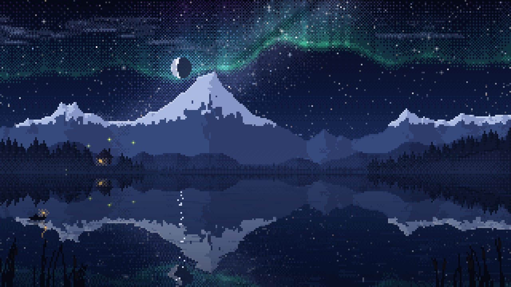

# Starlake

A living pixel-art lake that runs in the browser. One HTML file, no dependencies.



Each visit generates a new landscape (mountains, forest, a cabin on the shore) from a seed. The lake reflects everything above it, and the scene runs through a full day and night: aurora, shooting stars, fireflies, chimney smoke, a lantern-lit boat drifting across, birds by day. The moon shows today's real phase.

## Run it

Open `index.html` in a browser.

On an iPad or iPhone, load it over HTTP instead (the Files app preview doesn't run scripts). From this folder:

```sh
python3 -m http.server 8765
```

Then open `http://<your-computer's-ip>:8765` in Safari. Share → **Add to Home Screen** runs it full screen.

## Controls

| Input | Action |
| --- | --- |
| Click / tap the sky | Shooting star (birds in daytime) |
| Click / tap the lake | Ripple |
| Drag, scroll wheel, ← → | Scrub through the day |
| ↑ ↓ | Time speed (1×, 20×, 120×, 600×) |
| Space | Pause time |
| L | Follow your local clock |
| A | Aurora on / off |
| C | Clouds: clear, few, cloudy |
| N | New landscape |
| F | Fullscreen |
| H | Help panel (on touch screens, tap a line to use it) |

## URL options

Settings can go in the URL hash, e.g. `index.html#seed=4242&t=22.5`.

| Key | Meaning |
| --- | --- |
| `seed` | Landscape seed (shown in the help panel) |
| `t` | Starting hour, 0–24 |
| `speed` | `1`, `20`, `120` or `600` |
| `paused=1` | Start with time paused |
| `live=1` | Follow the local clock |
| `aurora=0` | Start with the aurora off |
| `clouds` | `0`, `1` or `2` |
| `moon` | Moon phase override, 0–1 (0 new, 0.5 full) |
| `help=1` | Open the help panel |
